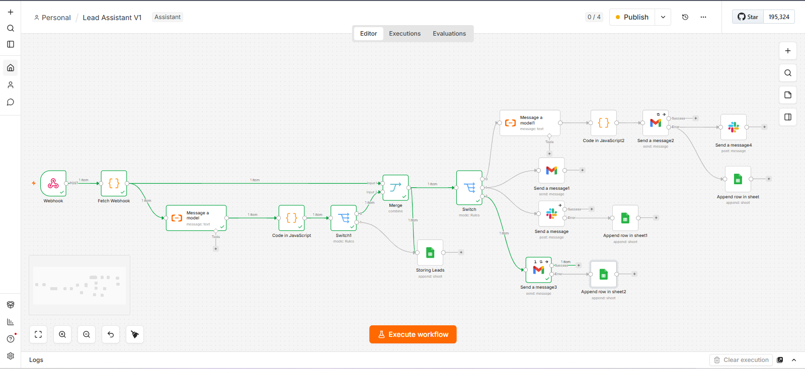

# AI Lead Qualification Case Study
**Project Name:**
## AI Lead Qualification System v1.0


## The Problem

Businesses often:

- Respond to leads too slowly.
- Waste time on low-quality leads.
- Forget to follow up.
- Have no automatic lead prioritization.
- Don't know when automations silently fail.

## The Solution

An AI-powered lead qualification workflow built with n8n that automatically analyzes incoming leads, routes them based on AI recommendations, and includes production-style error handling.

### It automatically:

* Receives new leads.
* Extracts and validates lead information.
* Uses AI to analyze lead quality.
* Scores the lead.
* Determines urgency.
* Recommends the next action.
* Routes the lead automatically.
* Handles workflow failures gracefully.

## Workflow

```text
Webhook
    ↓
Extract & Validate Lead
    ↓
AI Lead Analysis
    ↓
Parse AI JSON
    ↓
Validate AI Output
    ↓
Store Lead
    ↓
Route

├── Call Immediately
│     └── Slack Notification

├── Follow Up
│     ├── AI Email Generation
│     └── Gmail

└── Reject
      └── AI Rejection Email
```

<br>

### Implemented:

**JavaScript Validation**

Missing required fields
Invalid webhook payload
Safe JSON parsing

**AI Validation**

try/catch
JSON.parse()
Invalid AI response detection

**Node Error Handling**

Continue On Fail
Retry On Fail

**Failure Recovery**

If Gmail fails
->
Slack notification
->
Log into Failed Actions Google Sheet

If Slack fails
->
Log into Failed Actions

If Reject Email fails
->
Log into Failed Actions

<br>

###  Technologies

* n8n
* OpenAI
* Gmail
* Slack
* Google Sheets
* JavaScript


###  JavaScript Concepts Used

Objects,
Arrays, 
find(), 
Optional Chaining, 
JSON.parse(), 
try/catch, 
if statements, 
Validation, 
Booleans

<br>

### Workflow



<br>

### Instead of manually reviewing every lead:

AI qualifies the lead.
High-value leads are prioritized.
Follow-up emails are generated automatically.
Every lead is stored.
Failures are logged instead of disappearing.
Estimated Time

### Business Outcomes

- AI automatically qualifies every incoming lead.
- High-priority leads trigger instant Slack notifications.
- Medium-priority leads receive personalized follow-up emails.
- Low-quality leads receive a polite rejection email.
- Every lead is stored in Google Sheets.
- Failed actions are logged instead of silently disappearing.
